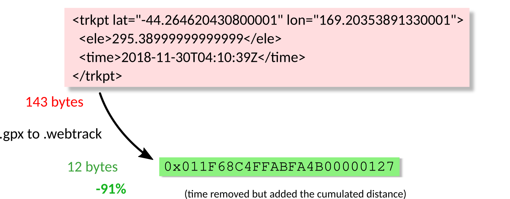

# The WebTrack Format

   [](https://github.com/prettier/prettier)

## Table of Contents

-   [Why The WebTrack Format?](#why-the-webtrack-format)
-   [How to Use?](#how-to-use)
-   [How to Build?](#how-to-build)
-   [What Technologies?](#what-technologies)
-   [What's Next?](#whats-next)

## Why The WebTrack Format?

**What GPS data interchange format should you use for a web application?**

The [GPX](https://en.wikipedia.org/wiki/GPS_Exchange_Format "GPS Exchange Format") and [KML](https://en.wikipedia.org/wiki/Keyhole_Markup_Language "Keyhole Markup Language") formats are part of the [XML](https://en.wikipedia.org/wiki/XML "Extensible Markup Language") family, quite verbose. The [Google Encoded Polyline Algorithm Format](https://developers.google.com/maps/documentation/utilities/polylinealgorithm "Polyline Format") is the opposite: very lightweight but contains only one line, had neither elevation data, nor waypoints. The [GeoJSON](https://en.wikipedia.org/wiki/GeoJSON "GeoJSON Format") format has [all features](https://tools.ietf.org/html/rfc7946#section-3.1.1 "The GeoJSON Format Spec") but lacks of extensibility and it is relatively heavy. [Vector tilesets](https://docs.mapbox.com/help/glossary/tileset/#vector-tilesets "Vector tilesets definition") are great but over-killed (and expensive) to implement for just a bunch of tracks. The [ProtocolBuffer Binary Format](https://github.com/protocolbuffers/protobuf/) is the most attractive solution for transfering GPS tracking data and a JavaScript library [exists](https://github.com/mapbox/pbf "JavaScript library for the Google Protobuf"), but a high-level interface managing tracks and waypoints as well as reading GPX data is still needed. This project aims to fill the gap between the rich GPX file and the simple Google polyline. This package includes a JavaScript implementation of the WebTrack file format. Read the [format specifications](SPEC.md) to find out more.

**Please take into account the following points:**

-   No track simplification (you could use the [Ramer-Douglas-Peucker algorithm](https://en.wikipedia.org/wiki/Ramer%E2%80%93Douglas%E2%80%93Peucker_algorithm))
-   No elevation data processing (if inaccurate or desired, I advise you the [SRTMGL1.003](https://www.patreon.com/posts/how-do-i-find-39707225 "How Do I Find Out The Elevation Profile?"))
-   Loss in location accuracy (points are projected to the Web Mercator and rounded)
-   Latitude cannot exceed 85° [north](https://www.openstreetmap.org/#map=5/85.049/-33.354) and [south](https://www.openstreetmap.org/#map=5/-85.049/-33.354) (it is a Web Mercator [limitation](https://en.wikipedia.org/wiki/Web_Mercator_projection#Formulas))
-   The [GPX Track Segments](https://www.topografix.com/GPX/1/1/#type_trksegType "GPX <trkseg/> definition") are merged
-   No file compression (you could [enable](./man/mod_deflate.md "Enable Apache mod_deflate With cPanel") the Apache mod_deflate for the WebTrack MIME type)

**How efficient is the compression?**

The WebTrack compression could be improved, but it's good enough:



## How to Use?

### Load

From an HTML document:

```html
<script src="./dist/webtrack.min.js"></script>
```

From a Node.js script:

```js
let WebTrack = require("./dist/webtrack.min.js");
```

### Play

**Basic Usage:**

```js
var webTrack = new WebTrack();

// GPX to WebTrack:
webTrack.loadGPX("<xml><gpx></gpx></xml>"); // parse a GPX file from string data
var webTrackBuffer = webTrack.getBuffer(); // here you have your binary data

// WebTrack to JavaScript Array:
webTrack.loadWebTrack(webTrackBuffer); // parse a WebTrack file from an ArrayBuffer
console.log(webTrack.getTrackInfo()); // print information about the file
console.log(webTrack.getTrack()); // print all segments
console.log(webTrack.getWaypoints()); // print all waypoints
```

Making an AJAX request for ArrayBuffer is simple, find out more in the [MDN web doc](https://developer.mozilla.org/en-US/docs/Web/API/XMLHttpRequest/Sending_and_Receiving_Binary_Data "Sending and Receiving Binary Data").

**Real World Usage:**

The WebTrack file format is used by ExploreWilder.com with the following technologies:

-   [VTS Browser JS](https://github.com/melowntech/vts-browser-js "Github repo"): [implementation](https://github.com/ExploreWilder/MainWebsite/blob/master/flaskr/static/app/scripts/map_player.js) and [example](https://explorewilder.com/map/player/9/last_minute_tramping_trip/Ecrins/fr)
-   [OpenLayers](https://github.com/openlayers/openlayers "Github repo"): [implementation](https://github.com/ExploreWilder/MainWebsite/blob/master/flaskr/static/app/scripts/map_viewer.js) and [example](https://explorewilder.com/map/viewer/9/last_minute_tramping_trip/Ecrins/fr)

A server side implementation is partially made in Python/Flask. Find out more in [my repo](https://github.com/ExploreWilder/MainWebsite/blob/master/flaskr/webtrack.py).

## How to Build?

1. [Install Node.js](https://www.digitalocean.com/community/tutorials/how-to-install-node-js-on-debian-10)
2. [Install Gulp](https://github.com/gulpjs/gulp/blob/master/docs/getting-started/1-quick-start.md)
3. Clone this repository
4. Install the package: `npm install`
5. Build: `gulp`
6. Then you can run:
    - Unit tests: `npm run test`
    - Check static types: `npm run flow`
    - Format the source code: `npm run prettier`
    - Check format: `gulp prettier-validation`

## What Technologies?

The minified script is standalone and babelified.

The library is made with the following exciting technologies:

-   JavaScript ES2015 (aka ES6)
-   [Flow](https://flow.org/ "Flow is a static type checker for JavaScript") (static type checker)
-   [Prettier](https://prettier.io/ "Prettier: an opinionated code formatter") (code formatter)
-   [Mocha](https://mochajs.org/ "Mocha is a feature-rich JavaScript test framework") (test framework)
-   [Gulp](https://gulpjs.com/ "A toolkit to automate & enhance your workflow") (automate workflow)

## What's Next?

I designed the [file format](SPEC.md) to perfectly fit my needs, but maybe not yours. Just let me know how it could be better!

Here you have a list of ideas that could be implemented:

-   Implement a track simplification algorithm or simply remove duplicated points,
-   The offset often fits in a single byte. So the value could be stored in two types: 1 or 2 bytes.
